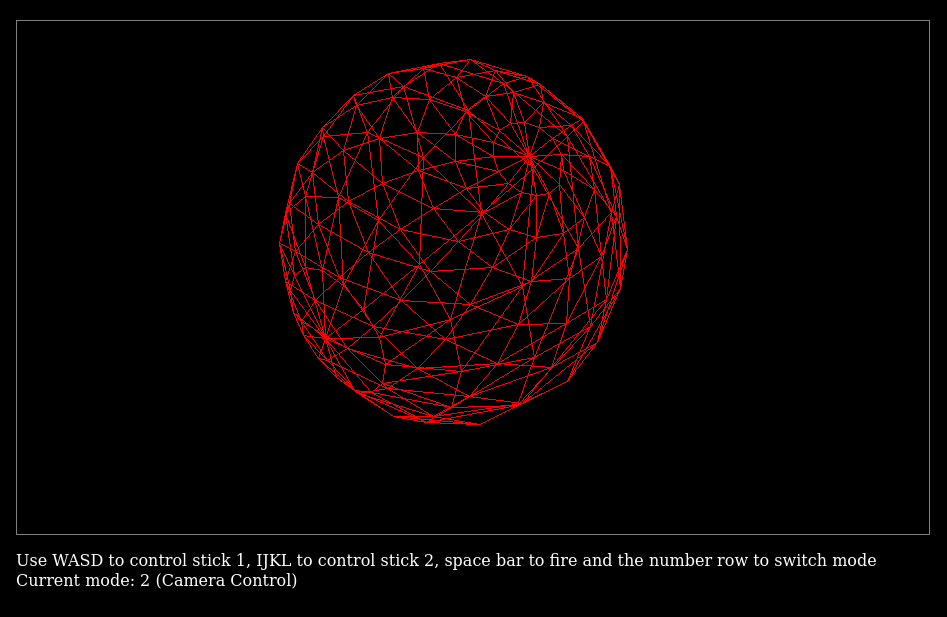

# Simple 3D Renderer

Simple 3D renderer made for Introdution to Computer Graphics class. 
It's really basic.

Requires threejs node module.
To build use the typescript compiler ("tsc -p ." ) and then run "./finish" to fix file paths
